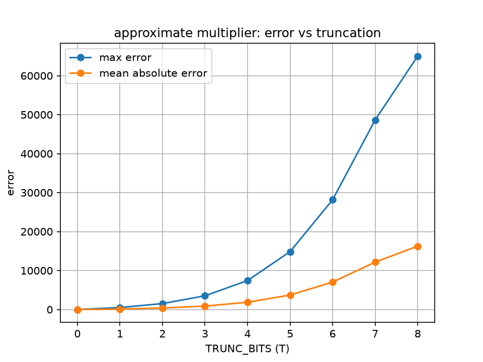
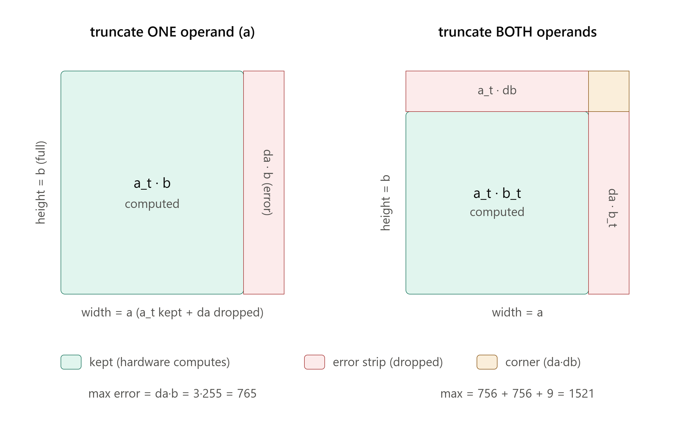
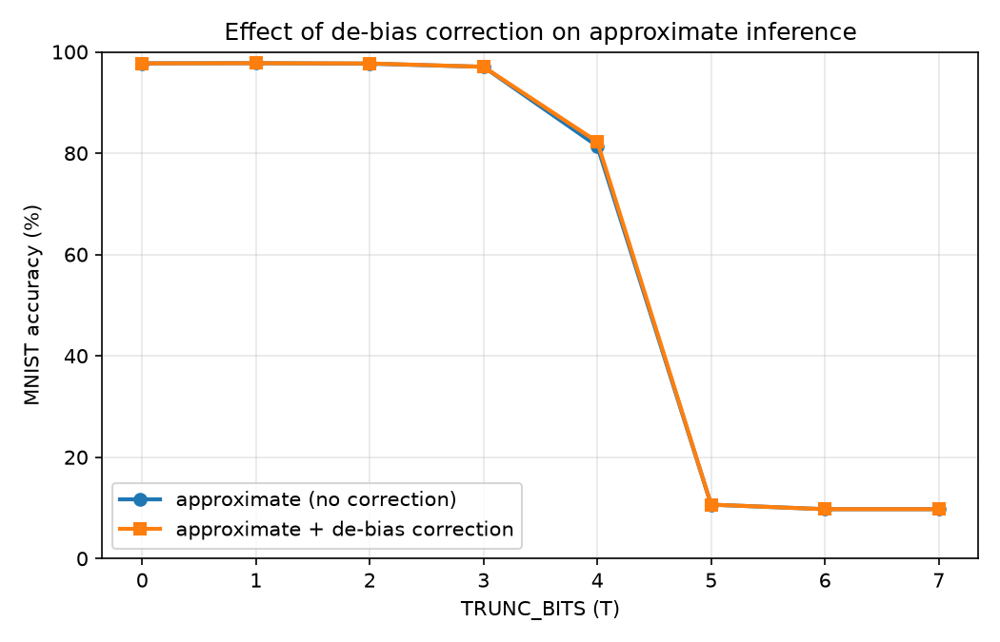
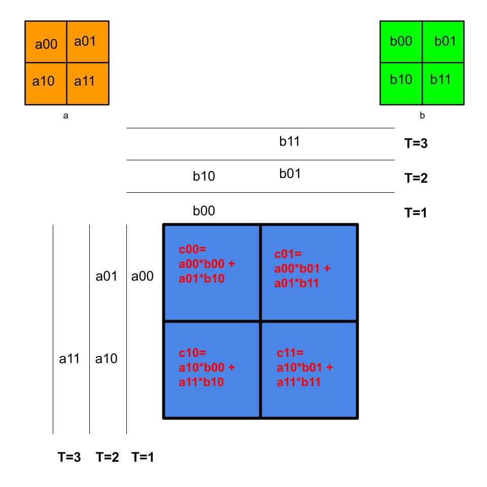

# approx-mult

Design space exploration of truncation based approximate multipliers for energy efficient AI hardware, evaluated on a real machine learning task and deployed to a physical Xilinx Zynq 7020 FPGA.


## What this project is

I built an approximate 8 by 8 multiplier in Verilog and explored the full design space of how much arithmetic accuracy you can trade away for area and power savings, then measured where that trade off actually starts to hurt a real neural network. The headline result is the Pareto front above: MNIST inference accuracy against multiplier area (LUTs on the Zynq), with each point a different truncation level. The curve stays flat while the network shrugs off the approximation, then falls off a cliff once truncation gets too aggressive. The knee at TRUNC_BITS = 2 is the efficient operating point.

On top of the exploration I added an original correction that removes the systematic bias of truncation, deployed the multiplier to a physical FPGA over a UART interface I wrote myself, and extended the single multiplier into a small systolic array so it becomes the core of an actual AI accelerator rather than just an arithmetic unit.

Everything here targets the same question that energy efficient accelerator research cares about: how far can you push approximate arithmetic before the application breaks, and what does that buy you in hardware.

## The approximate multiplier

The multiplier truncates the low TRUNC_BITS of both operands before multiplying, which zeros out the least significant bits and shrinks the hardware. Truncation always rounds down, so the error is one sided and predictable, which becomes important later for the correction.

```verilog
a_trunc = (a >> TRUNC_BITS) << TRUNC_BITS;
b_trunc = (b >> TRUNC_BITS) << TRUNC_BITS;
product = a_trunc * b_trunc + CORRECTION;
```

Measured on the Zynq (xc7z020clg484-2, post synthesis), the area and error scale cleanly with truncation:

| TRUNC_BITS | LUTs | max error |
|------------|------|-----------|
| 0 (exact)  | 70   | 0         |
| 2          | 39   | 380       |
| 4          | 14   | 1856      |
| 6          | 2    | 7040      |



## Design space exploration

I swept the multiplier across two independent knobs, operand bit width and truncation, and synthesized every configuration on the real chip to get honest area numbers rather than estimates. One finding I can defend: for a given accuracy budget, reducing the operand bit width is more area efficient than truncating a wider multiplier. A 6 bit exact multiplier (38 LUTs, zero error) lands almost exactly where an 8 bit multiplier at TRUNC_BITS = 2 does (39 LUTs, 380 error), which tells you the two knobs are not equivalent and which one to reach for first.



I then quantized a small MLP (784, 128, 10) to int8 and ran MNIST inference with the approximate multiplier in the loop to see where the approximation actually costs accuracy:

| TRUNC_BITS | MNIST accuracy |
|------------|----------------|
| 0          | 97.7%          |
| 2          | 97.7%          |
| 3          | 97.0%          |
| 4          | 81.4%          |
| 5          | 10.6%          |


The network tolerates approximation up to roughly TRUNC_BITS = 3 despite the per multiply error being large, because classification only depends on which output is the argmax, not on the exact logit values. Past that point the accuracy collapses sharply rather than gradually. This is the cliff you can see on the Pareto front, and the knee sits right before it.

## De-bias correction (my main original contribution)

Because truncation always rounds down, the error is not random noise, it is a consistent negative bias. That means it is correctable. I added a single constant CORRECTION term to the RTL that adds back the mean error, which costs one adder and is essentially free in hardware.

What I measured, and can explain:

- On a single multiply at width 8 and TRUNC_BITS = 2, adding the mean error as CORRECTION cut the total absolute error by about 40 percent and dropped the max error by exactly the correction amount.
- On accumulated MACs, once the constant bias is removed the errors largely cancel when summed, so the accumulated error collapses.
- On MNIST, the correction helps right at the cliff edge (TRUNC_BITS = 4 improves from 81.4 to 82.2 percent) but it does not move the cliff.

The reason it cannot move the cliff is the part I am most proud of understanding: the correction removes a constant bias, but the collapse at high truncation is driven by variance, not bias. A uniform bias shift does not change which output is the argmax, so once the approximation is noisy enough to flip the argmax, a constant correction cannot save it. Bias is correctable, variance is not, and argmax is what ultimately decides.



## FPGA deployment

I deployed the approximate multiplier to the physical Zynq board with a UART interface so a host PC can drive it with live data. I wrote the UART receiver and transmitter myself as state machines, including the bit timing (434 clocks per bit at 115200 baud on the 50 MHz clock), the mid bit sampling on receive, and a two flip flop synchronizer on the asynchronous receive line to avoid metastability.

The final version takes two operands over serial, multiplies them with the approximate multiplier on the board, and sends the 16 bit result back as two bytes. I verified it on hardware by sending known operand pairs and decoding the returned bytes, and the results matched the TRUNC_BITS = 2 predictions exactly, including seeing the truncation change an operand before the multiply. This confirms the design does not just simulate correctly, it runs on real silicon driven by external data, which is the deployment half of a real accelerator.

## Systolic array

I extended the single multiply accumulate cell into a 2 by 2 systolic array, which is the canonical architecture for AI accelerators such as the TPU, because a matrix multiply is exactly what a neural network layer computes. Each cell is my approximate MAC plus registers that forward operands to the neighboring cells, which is the sliding data movement that lets operands be reused across cells instead of refetched, and that reuse is where the energy and throughput efficiency comes from.



The diagram above is how I worked out the skew. Operands stream in from the top and left edges, staggered by one cycle per row and column, so that as they slide through the cells the correct matrix terms meet at the correct cell at the correct cycle. I verified the array in simulation against a hand computed matrix product:

```
A = [[1,2],[3,4]],  B = [[5,6],[7,8]]  ->  C = [[19,22],[43,50]]
```

The simulation produces exactly that, and you can watch the diagonal completion wavefront as the top left cell finishes first and the bottom right cell finishes last, which is the visual signature of a working systolic array. This turns the project from a characterized arithmetic unit into the core of an approximate arithmetic accelerator, and it extends the design space exploration from the component level up to the array level.

## Repository layout

- `mult_approx.v`, `mult_exact.v`, `mac.v` are the approximate and exact multipliers and the MAC
- `pe.v`, `systolic_2x2.v` are the systolic processing element and the 2 by 2 array
- `fpga/` holds the top level wrappers and constraints for the Zynq deployment (UART interface)
- `tb_*.v` are the testbenches for every module
- `sweep.py`, `plot_pareto.py`, `mnist_quantized.py` and related scripts are the exploration and evaluation tooling
- `*.csv` are the measured area, power, error, and accuracy data
- `pareto_accuracy_vs_luts.png`, `area_model.png`, `error_vs_truncation.png`, `mnist_quantized_accuracy.png`, `mnist_corrected_accuracy.png` are the result figures

## Notes on tools and authorship

I wrote all of the Verilog myself, including the multiplier, the MAC, the UART receiver and transmitter, the systolic processing element and array, and the de-bias correction, and I ran all of the synthesis and hardware deployment. The design decisions, the de-bias idea, the bias versus variance analysis, and the interpretation of the results are mine. I used an AI assistant to help with the Python tooling that surrounds the RTL, such as the sweep automation, the plotting, and the int8 MNIST harness, and I read through and understood that code rather than treating it as a black box.