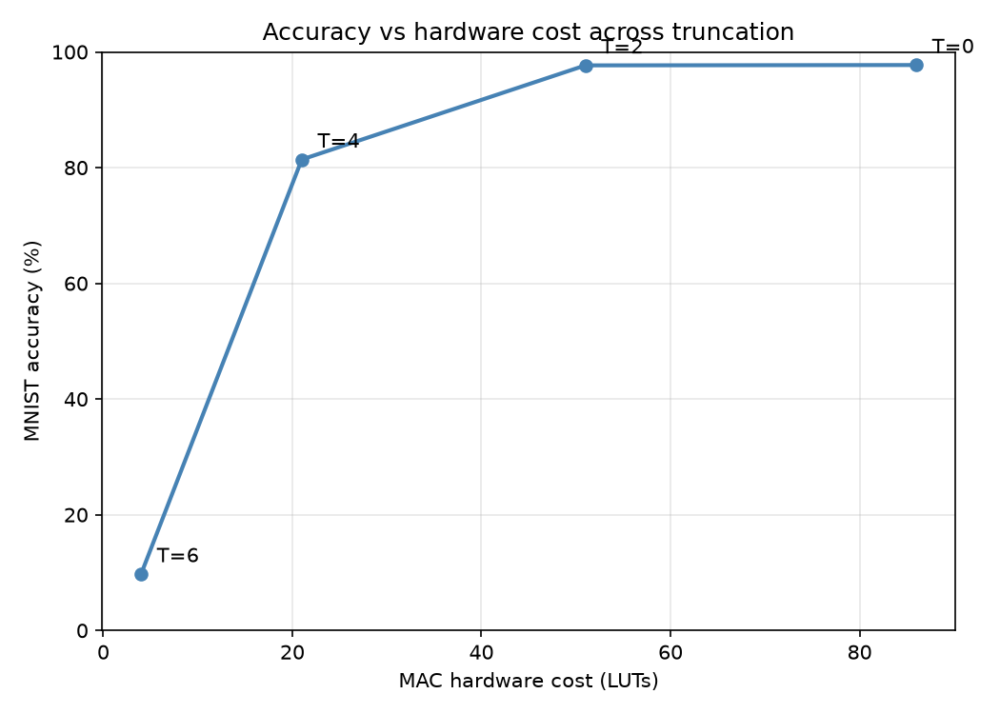
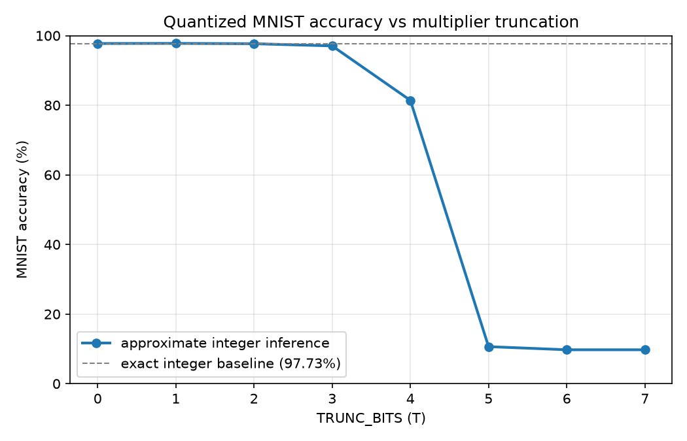
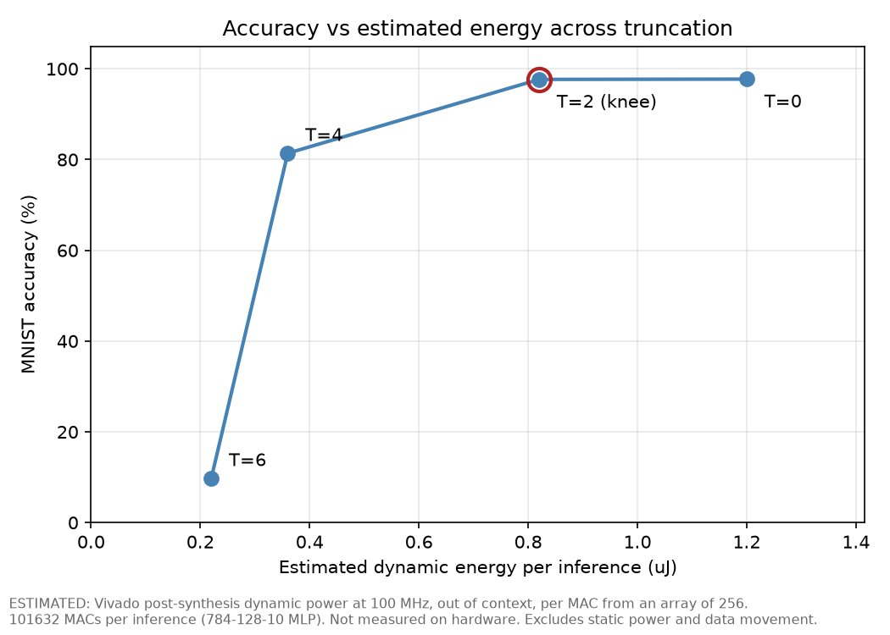

# approx-mult

Truncation based approximate multipliers in Verilog, explored across a design space, built up into a 2x2 systolic array with an on-chip weight memory, tested on MNIST, and run on a Zynq 7020.



## Overview

This project measures how much arithmetic accuracy a neural network tolerates before classification breaks down, and what that approximation returns in hardware cost.

The starting point is an 8x8 approximate multiplier that truncates the low bits of both operands. It is swept across operand bit width and truncation depth, every configuration is synthesised, and the error is measured exhaustively over the full input space. The multiplier is then built up into a MAC, a 2x2 systolic array, and a weight memory feeding that array. A systolic array performing matrix multiplication is the datapath of an AI accelerator, so the array is where the arithmetic result becomes an architectural one.

Truncation error is one sided. That makes it correctable with a single adder, and the correction is measured here along with the reason it helps less than the error reduction suggests.

This is a self-directed learning project, not coursework and not a research contribution. It exists because I wanted to learn digital design by building something end to end rather than by reading about it. The measurements are real and reproducible from this repository, and the scale is deliberately small: an 8 bit multiplier, a 2x2 array, and a small fully connected network. Where something is estimated rather than measured, or built but not verified, it says so.

## Systolic array


Each cell is an approximate MAC plus two registers that forward the operands to its neighbours. Operands propagate through the array rather than being re-fetched for every cell, which is the source of the efficiency.

The drawing above records the timing derivation. Operands enter from the top and left, staggered one cycle per row and column, so that corresponding terms arrive at each cell on the cycle that requires them.

Verified against a hand calculation. A = [[1,2],[3,4]] and B = [[5,6],[7,8]] give C = [[19,22],[43,50]]. The simulation reproduces those values, completing on a diagonal wavefront.

## Weight memory

Dual port ROM holding the weights, written in the pattern Vivado infers as Block RAM, plus an address generator that reproduces the systolic skew and accounts for the memory's one cycle read latency.

Verified against a hand calculation using real quantised MNIST weights. With mem[1..4] = 2, 5, 2, 248 loaded and A = [[1,2],[3,4]] streamed in, the array gives C = [[6, 501], [14, 1007]]. The 248 is the weight -8 read as an unsigned byte, since the multiplier is unsigned.

Synthesis confirms it infers a RAMB18E1, one block serving both read ports. The report is in `syn/reports/bram_utilisation_synth.txt`.

## De-bias correction

Truncation always rounds down, so the error is a consistent negative bias rather than noise. That makes it correctable.

Mean absolute error at 8 bits with TRUNC_BITS = 2 is 380. Adding 380 back into the product cancels most of the bias at the cost of one adder. Across all 65536 input pairs this reduces total absolute error from 24.9M to 15.0M, approximately 40 percent.


The correction has almost no effect on the MNIST accuracy cliff. Adding a constant shifts every output by the same amount, and classification depends on which output is largest rather than on its value, so a uniform shift cannot change the argmax. Accuracy at high truncation is limited by the variance of the per multiply error, which a constant correction does not address.

Bias is correctable, variance is not, and argmax is what decides.

## Design space

```verilog
a_trunc = (a >> TRUNC_BITS) << TRUNC_BITS;
b_trunc = (b >> TRUNC_BITS) << TRUNC_BITS;
product = a_trunc * b_trunc + CORRECTION;
```

Error measured over all 65536 input pairs at 8 bits, with CORRECTION = 0 so this is the raw truncation tradeoff. LUT counts are for `mult_approx` alone.

| TRUNC_BITS | LUTs | mean abs error | max error |
|------------|------|----------------|-----------|
| 0 (exact)  | 70   | 0              | 0         |
| 2          | 39   | 380            | 1521      |
| 4          | 14   | 1856           | 7425      |
| 6          | 2    | 7040           | 28161     |


The sweep covers two parameters, operand bit width and truncation depth, with every configuration synthesised.

Narrowing the operands outperforms truncating a wider multiplier at equal area. A 6 bit exact multiplier is 38 LUTs with zero error over its range. An 8 bit multiplier at TRUNC_BITS = 2 is 39 LUTs with a mean error of 380. The hardware cost is the same and the error is not. The two parameters are not interchangeable.


## On MNIST

| TRUNC_BITS | accuracy |
|------------|----------|
| 0          | 97.7%    |
| 2          | 97.7%    |
| 3          | 97.0%    |
| 4          | 81.4%    |
| 5          | 10.6%    |



Accuracy holds to TRUNC_BITS = 3 despite a large per multiply error, because classification depends only on the argmax. Beyond that it collapses. TRUNC_BITS = 2 is the knee of the tradeoff and the operating point this design targets.

## Energy

Energy, not area, is the figure of merit for an accelerator. The values below are estimates rather than board measurements, but every one is derived from a committed Vivado report: dynamic power divided by the clock frequency, both read out of `syn/reports/`.

The network is 784-128-10, giving 784 x 128 + 128 x 10 = 101632 multiply accumulates per inference. A single MAC unit at one operation per cycle takes 1.016 ms per inference at 100 MHz.

Figures are per MAC, divided down from an array of 256 synthesised out of context. Both details change the numbers by an order of magnitude and are explained under Synthesis.

| TRUNC_BITS | LUTs | FFs | accuracy | pJ per MAC | uJ per inference | vs exact |
|------------|------|-----|----------|------------|------------------|----------|
| 0 (exact)  | 64   | 32  | 97.7%    | 11.8       | 1.20             | -        |
| 2          | 42   | 28  | 97.7%    | 8.1        | 0.82             | 31.7% less |
| 4          | 15   | 24  | 81.4%    | 3.5        | 0.36             | 70.0% less |
| 6          | 4    | 20  | 9.7%     | 2.1        | 0.22             | 81.7% less |



At TRUNC_BITS = 2 the accuracy cost is 0.06 percentage points and the energy reduction is 31.7 percent.

Between TRUNC_BITS = 0 and TRUNC_BITS = 6 the MAC falls from 64 LUTs to 4, a factor of 16, while energy falls by a factor of 5.6. Energy does not track area, and the flip-flop column shows why. At maximum truncation only 4 LUTs of multiplier remain, but 20 flip-flops of accumulator and the clock network driving them do not shrink with the operands. Those set the floor. Beyond the knee, further truncation costs accuracy and returns progressively less energy, which is the conclusion the area data reaches independently.

Energy per inference is independent of how many MAC units run in parallel, since power and cycle count scale together. Parallelism reduces latency and energy delay product, not energy.

## On the FPGA

The multiplier is deployed to a Zynq 7020 with a UART interface so a host PC can drive it. The RX and TX state machines are hand written, covering bit timing at 115200 baud from the 50 MHz clock, mid bit sampling on receive, and a two flip flop synchroniser on the asynchronous receive line.

The design accepts two operands over serial, multiplies on the board, and returns the 16 bit result. The returned bytes were checked on hardware against the truncation predictions.

An AXI4-Lite wrapper was added subsequently so the ARM processing system can drive the accelerator instead of serial, built in Vivado and Vitis. The wrapper is in `rtl/axi/` and the C driver in `sw/`. Its verification status is recorded under Limitations.

## Running it

Tested with Icarus Verilog 12.0 and Vivado 2026.1, targeting xc7z020clg484-2.

```
# all three simulations
bash flow/run_sims.sh

# self-checking scoreboard, expect FAIL=0
iverilog -g2012 -o sim_sb tb/tb_mult_approx_scoreboard.v rtl/mult_approx.v && vvp sim_sb

# sweep and figures
python3 flow/sweep.py
python3 flow/plot_pareto.py

# energy metrics and the energy Pareto
python3 flow/energy.py
python3 flow/plot_energy.py
```

Everything runs from the repo root. `weight_mem.v` loads `weights.hex` by a bare relative path, which is why the file stays at the root and why the working directory matters. For Vivado, add `weights.hex` to the project as a design source or `$readmemh` will not find it.

## Synthesis

Everything was synthesised in Vivado 2026.1 against the Zynq 7020, part xc7z020clg484-2. Each module was run standalone rather than as part of a larger design, so the utilisation figures describe the module itself and not its share of a bigger netlist. The clock constraint is `constr/mac.xdc`, a 10 ns period.

Every LUT, flip-flop and power figure in this README is read from a Vivado report, and every report is committed under `syn/reports/`. The BRAM one is the evidence that `weight_mem` infers a RAMB18E1 rather than being built out of distributed LUT memory, which is the difference between using a hard block and accidentally spending fabric on a memory.

The MAC sweep is scripted rather than clicked:

```
vivado -mode batch -source syn/scripts/synth_mac.tcl
python3 flow/parse_reports.py
```

Two decisions in that flow matter more than they look.

**Out of context.** Synthesising a small module normally inserts I/O buffers, and they dominate. Measured with pads, the MAC reported 19 mW of dynamic power of which 17 mW was the pads. Worse, the trend across truncation was partly Vivado deleting the input pads for operand bits that truncation had made unused, which says nothing about the arithmetic. A MAC is internal logic in any real accelerator, so it is synthesised with `-mode out_of_context` and measured without pads.

**An array of 256.** One MAC out of context reports 0.001 W, the resolution floor of `report_power`, so every truncation level would read the same value. `syn/mac_array.v` instantiates 256 copies to lift the total clear of that floor, and the per-MAC figures are divided back down. The copies take per-index XOR constants on their operands so synthesis cannot merge them into one shared multiplier, and every accumulator drives a slice of a wide output so none are pruned away.

### Timing

Worst negative slack against the 10 ns constraint gives maximum frequency:

| TRUNC_BITS | Fmax |
|------------|------|
| 0 (exact)  | 437 MHz |
| 2          | 456 MHz |
| 4          | 474 MHz |
| 6          | 472 MHz |

Truncation buys speed as well as area and energy, because dropping low operand bits shortens the carry chains through the partial product adder. All four configurations meet the 100 MHz constraint with a wide margin, so timing is not what limits this design.

## Layout

- `rtl/` is the design: multipliers, MAC, processing element, array, weight memory, address generator. `rtl/axi/` is the AXI4-Lite slave wrapper
- `tb/` is the testbenches, including the self-checking scoreboard
- `syn/reports/` is the Vivado reports, `syn/scripts/` is the batch flow for regenerating them
- `constr/` is the timing and pin constraints
- `fpga/` is the board top level for the UART deployment
- `sw/` is the C driver that runs on the ARM side
- `flow/` is the sweep, evaluation and plotting tooling
- `results/` is the measured data, except `energy_results.csv` which is derived from `mac_results.csv`
- `docs/figures/` is the figures
- `weights.hex` stays at the root because `$readmemh` loads it by bare filename

## Limitations

- The array is 2x2. The dataflow and memory interface generalise but the parameterised NxN version is not written.
- Everything is unsigned, so negative weights come through as large positive numbers. Signed arithmetic is the next extension.
- Power and energy numbers are Vivado post synthesis estimates, not measured on the board. Vivado rates their confidence as Medium because switching activity is estimated vectorlessly from default toggle rates rather than taken from a simulation of real data. Reading a SAIF from an MNIST-operand run would replace that assumption with measured activity.
- The energy model assumes one MAC per cycle and ignores data movement and memory stalls.
- The AXI4-Lite wrapper synthesised, the block design built and the board booted and ran it, but no verified register read was obtained. A JTAG/DAP fault blocked the last step. The UART path is the one verified on hardware.
- The sweep is a script running one configuration at a time, not a real automated exploration framework.
- MNIST here is a small fully connected network, not a CNN.

## Authorship

I used an AI assistant on parts of this project. Splitting it out explicitly, because a reader cannot tell from the files and because the distinction is the whole point of the exercise.

**Written by me, line by line:**

- Every Verilog file in `rtl/` and `fpga/`: the multipliers, the MAC, the de-bias correction, the UART receiver and transmitter, the processing element and array, the weight memory and address generator, and the AXI4-Lite wrapper
- `syn/mac_array.v`, the synthesis measurement harness
- All the testbenches in `tb/`, including the self-checking scoreboard
- Every synthesis run and the hardware deployment
- The design decisions and the analysis: the de-bias scheme, the bias versus variance conclusion, and the systolic dataflow and timing

**Written with AI assistance, then read and understood:**

- Every Python file in `flow/`: MNIST training and quantisation, inference evaluation, sweep automation, weight extraction, plotting, and the Vivado report parser
- The Tcl in `syn/scripts/`
- Much of the prose in this README

The dividing line is that the hardware is mine and the tooling that measures it is not. I can explain any line in either category, including why the synthesis runs out of context and why the harness instantiates 256 copies, but I did not type the second category from scratch and will not claim otherwise.
